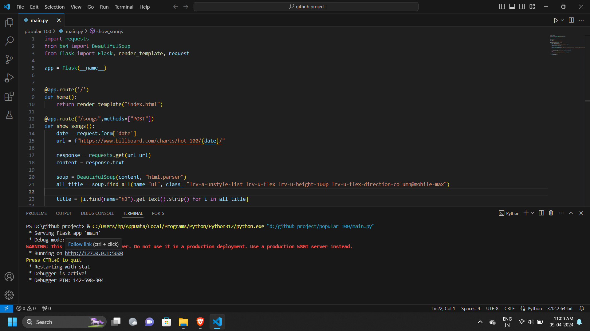
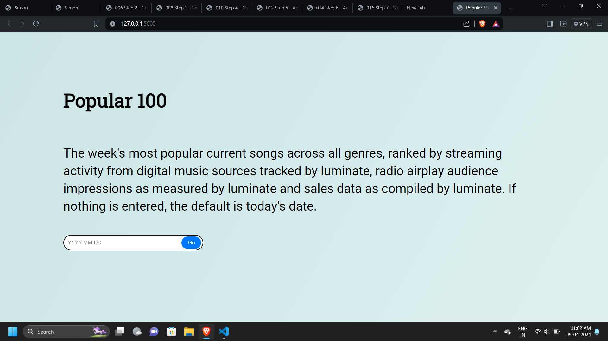
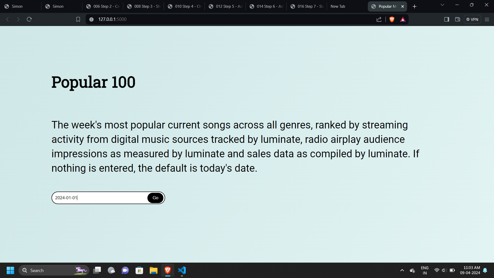
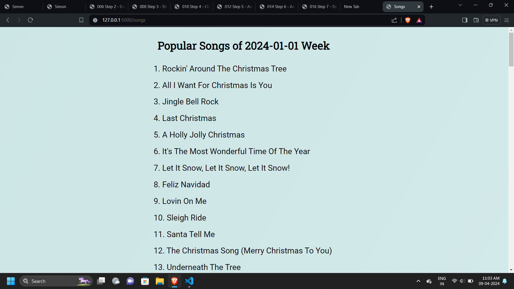
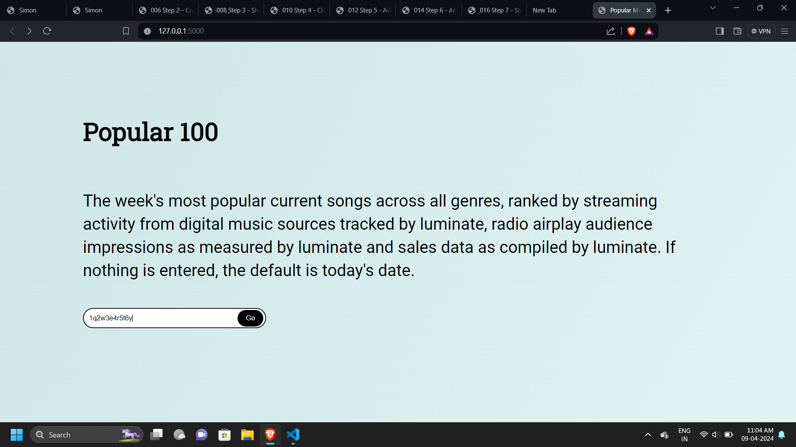
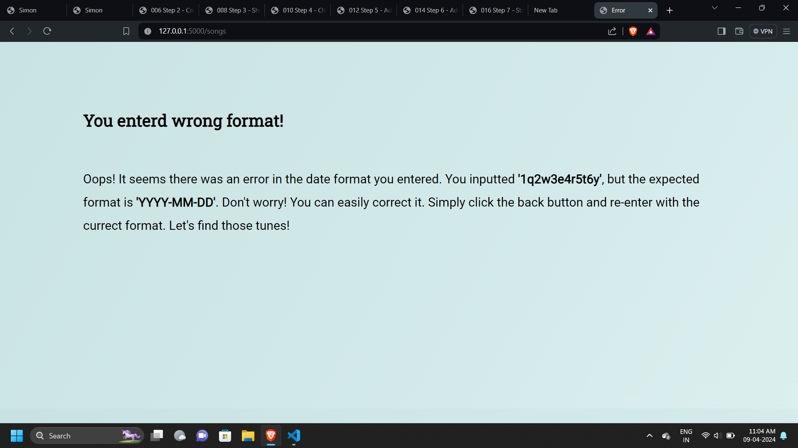

# Week's Top 100 Songs Web Scraper

This project allows users to enter a date and retrieve the top 100 songs for that week from a specified website.

## How It Works

1. **Input Date**: Users input a date through the website interface.
2. **Web Scraping**: The backend Python code scrapes the website for the top 100 songs for the given week.
3. **Data Extraction**: The scraper extracts the song titles and other relevant information.
4. **Display**: The user is then presented with a list of the top 100 songs for the specified week on a new webpage.
## Live Website

This is a live website; click [here](https://popular-100-songs.onrender.com/) to visit.
## Screenshots

1. ### Local Server Running
   
   This image shows the local server running after executing `python app.py`.
   

2. ### User Interface
   
   This image displays the user interface where users can enter a date.
   

3. ### Input Date
   
   This image shows the user entering a date into the input field.
   

4. ### Top 100 Songs
   
   After submitting the date, users are presented with a list of the top 100 songs for that week.
   

5. ### Incorrect Input Format
   
   This image shows an example of entering the wrong input format.
   

6. ### Error Page
   
   When an error occurs, users are directed to an error page with relevant information.
   

